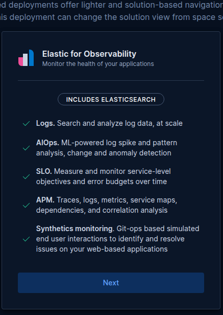
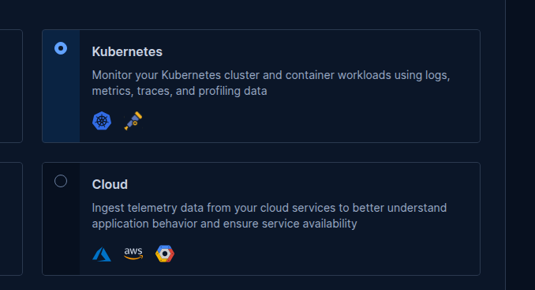
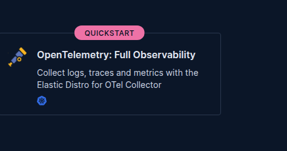
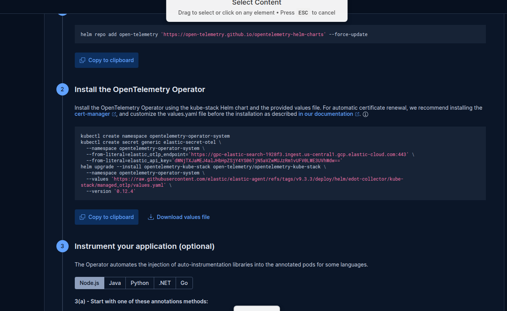

# Build an AI Observability Pipeline on GKE That Tells You Who Broke Production

Production crashes are stressful. A pod enters `CrashLoopBackOff`, alerts fire, and engineers scramble — running `kubectl` commands, grepping logs, cross-referencing Slack history, hoping someone remembers what deployed last. This manual debugging burns time and extends downtime.

This article shows you how to eliminate that scramble. By the end, you'll have a Kibana AI agent that you can ask *"why is paymentservice crashing?"* — and it will tell you the exact commit SHA, the author, what they changed, and how to fix it.

---

## Architecture Overview

The pipeline has two data flows converging on a single AI agent:

- **Infrastructure flow**: Code pushed → ArgoCD syncs to GKE → pod crashes → OpenTelemetry ships the crash event to Elasticsearch (`logs-*`)
- **Metadata flow**: Code pushed → GitHub Actions POSTs commit metadata to Elasticsearch (`github-deployments`)
- **Agent**: Kibana AI agent cross-references both indices to answer the question


---

## Key Concepts

| Concept | What It Does |
|---------|-------------|
| Elasticsearch provisioning | Managed cluster on GCP Marketplace — stores logs and commit metadata |
| OpenTelemetry configuration | Ships Kubernetes pod logs and cluster events to Elasticsearch |
| Git metadata indexing | GitHub Action writes commit history, authors, and diff URLs to a custom ES index |
| ArgoCD deployment management | GitOps sync — auto-deploys every push to your GKE cluster |
| AI diagnostic agent | Kibana Agent Builder with ES\|QL tools — cross-references crashes with deploy history |

**Why the setup order matters:**
1. Push manifests to GitHub **before** creating the ArgoCD app — it deploys whatever is in the repo at first sync
2. Elastic Cloud must exist **before** installing OTel — OTel needs the endpoint and API key
3. Create the `github-deployments` index **before** adding GitHub secrets — the first push writes to it immediately
4. Everything must be running **before** the demo — the agent needs data in both indices

---

## Prerequisites

Install these CLI tools on your local machine before starting:

- Google Cloud SDK (`gcloud`)
- Kubernetes CLI (`kubectl`)
- Helm
- ArgoCD CLI
- GitHub CLI (`gh`) + Git

Connect `kubectl` to your GKE cluster:

```bash
gcloud container clusters get-credentials <CLUSTER_NAME> \
  --zone us-central1-a \
  --project <YOUR-GCP-PROJECT>
```


Verify the connection:

```bash
kubectl get nodes
# Expect: 3 nodes, Status: Ready
```


> **Node pool sizing:** Use `e2-standard-4` machines with 3 nodes. `e2-standard-2` is too small — 12 microservices + OTel DaemonSets + ArgoCD need approximately 6 vCPU headroom.

---

## Step 1 — Provision Elasticsearch from GCP Marketplace

Rather than managing your own cluster, deploy Elasticsearch directly from the GCP Marketplace. This keeps billing consolidated and removes infrastructure overhead.

1. Open the GCP Console → search **Marketplace**


2. Search for **Elastic Cloud** → select **Elastic Cloud (Elasticsearch Service)**


3. Subscribe → click **Manage on Provider** — this redirects you to the Elastic Cloud console


4. In the Elastic portal, click **Create hosted deployment**


5. Select **Elastic for Observability** — this deployment type is pre-configured with log aggregation, APM, and AI Ops features required for this project




6. Set **Cloud provider: Google Cloud**, **Region: us-central1**, name your deployment (e.g., `demo-deploy`) → click **Create hosted deployment**


Provisioning takes ~5 minutes. **Download or copy the `elastic` password immediately** — it is shown only once.


### Get your endpoints

From the Elastic Cloud console → click your deployment:

| What | Where to find it | Used for |
|------|-----------------|----------|
| Elasticsearch endpoint | **Elasticsearch** → **Copy endpoint** | GitHub Actions secret `ES_ENDPOINT`, curl commands |
| OTLP ingest endpoint | **Integrations** → **Manage** → **APM** → copy OTLP endpoint | OTel kube-stack secret `elastic_otlp_endpoint` |

---

## Step 1b — Generate a Kibana API Key

Before installing OTel or setting up GitHub Actions, generate the API key you'll reuse in both. Navigate to:

```
https://<YOUR-KIBANA-URL>/app/management/security/api_keys
```

Or via the menu: Kibana → ☰ → **Stack Management** → **Security** → **API Keys**


Click **Create API key**, give it a name (e.g., `github-deploy-key`), and click **Create API key**.


Copy the key immediately — it is shown only once. You will use this same key for:
- `elastic_api_key` in the OTel Kubernetes secret (Step 2)
- `ES_API_KEY` in your GitHub repository secrets (Step 3)

Now verify your Elasticsearch endpoint is reachable using that key:

```bash
curl -s -w "\nHTTP:%{http_code}" \
  -X GET "<YOUR-ES-ENDPOINT>" \
  -H "Authorization: ApiKey <YOUR-API-KEY>"
# Expect: HTTP:200
```

---

## Step 2 — Configure OpenTelemetry to Ship Kubernetes Logs

OpenTelemetry is the bridge between your GKE cluster and Elasticsearch. Once installed, it automatically ships all pod logs and cluster metrics — no per-app instrumentation needed.

1. In Elastic, open your deployment → click **Add Observability Data**


2. Select **Kubernetes**


3. Under **Monitor your Kubernetes cluster using**, select **OpenTelemetry: Full Observability**





Elastic pre-populates the Helm install commands with your cluster's endpoint and credentials.

4. Add the Helm repo:


```bash
helm repo add open-telemetry \
  https://open-telemetry.github.io/opentelemetry-helm-charts --force-update
```

5. Create the namespace and secret, then install:




```bash
kubectl create namespace opentelemetry-operator-system

kubectl create secret generic elastic-secret-otel \
  --namespace opentelemetry-operator-system \
  --from-literal=elastic_otlp_endpoint='<YOUR-OTLP-INGEST-ENDPOINT>' \
  --from-literal=elastic_api_key='<YOUR-API-KEY>'

helm upgrade --install opentelemetry-kube-stack \
  open-telemetry/opentelemetry-kube-stack \
  --namespace opentelemetry-operator-system \
  --values 'https://raw.githubusercontent.com/elastic/elastic-agent/refs/tags/v9.3.3/deploy/helm/edot-collector/kube-stack/managed_otlp/values.yaml' \
  --version '0.12.4'
```

> If Helm fails with a conflict error, run `helm uninstall opentelemetry-kube-stack -n opentelemetry-operator-system` and reinstall.

Verify all pods are running:

```bash
kubectl get all -n opentelemetry-operator-system
```


---

## Step 2b — Verify Logs Are Flowing in Kibana

Before moving on, confirm that OpenTelemetry is successfully shipping your cluster logs to Elasticsearch. Open Kibana and navigate to **Discover**.

You can get your Kibana URL from the Elastic Cloud deployment overview page — it lists all application endpoints including the public Kibana URL.


In Kibana Discover, select **All logs** from the data view dropdown, set the time range to **Last 15 minutes**, and you should see a stream of log documents arriving from your GKE pods — including system components, OTel collectors, and your application services.


If you see documents, OTel is working correctly and you can proceed.

---

## Step 3 — Index Git Commit Metadata via GitHub Actions

For the AI agent to answer *"who deployed this?"*, Elasticsearch needs commit metadata: author, SHA, what changed, when. A GitHub Action handles this automatically on every push — no Kubernetes component needed, Actions runs in GitHub's cloud and POSTs directly to Elasticsearch.

### 3a. Create the Elasticsearch index

```bash
curl -X PUT "<YOUR-ES-ENDPOINT>/github-deployments" \
  -H "Authorization: ApiKey <YOUR-API-KEY>" \
  -H "Content-Type: application/json" \
  -d '{
    "mappings": {
      "properties": {
        "timestamp":  { "type": "date" },
        "commit_sha": { "type": "keyword" },
        "author":     { "type": "keyword" },
        "service":    { "type": "keyword" },
        "image_tag":  { "type": "keyword" },
        "change":     { "type": "text" },
        "diff_url":   { "type": "keyword" }
      }
    }
  }'
# Expect: {"acknowledged":true}
```


### 3b. Add GitHub repository secrets

```bash
gh secret set ES_ENDPOINT \
  --repo <YOUR-GITHUB-USERNAME>/<YOUR-REPO> \
  --body "<YOUR-ES-ENDPOINT>"

gh secret set ES_API_KEY \
  --repo <YOUR-GITHUB-USERNAME>/<YOUR-REPO> \
  --body "<YOUR-API-KEY>"
```


### 3c. The workflow file

Create `.github/workflows/index-deploy.yml` in your repository. On every push to `main` it:

1. **Detects which service changed** — diffs `release/kubernetes-manifests.yaml` between the last two commits and greps added lines for a service name
2. **POSTs one JSON document** to the `github-deployments` index with timestamp, commit SHA, author, service, commit message, and diff URL

```yaml
name: Index deployment to Elasticsearch

on:
  push:
    branches: [main]

jobs:
  index:
    runs-on: ubuntu-latest
    steps:
      - uses: actions/checkout@v4
        with:
          fetch-depth: 2

      - name: Detect changed service
        id: changed
        run: |
          CHANGED=$(git diff HEAD~1 HEAD -- release/kubernetes-manifests.yaml \
            | grep '^+' \
            | grep -oP 'name:\s+\K[a-z][a-z0-9-]+service' \
            | head -1)

          if [ -z "$CHANGED" ]; then
            CHANGED=$(git diff HEAD~1 HEAD -- release/kubernetes-manifests.yaml \
              | grep -oE 'paymentservice|cartservice|frontend|recommendationservice|adservice|checkoutservice|productcatalogservice|currencyservice|shippingservice|emailservice|redis-cart|loadgenerator' \
              | head -1)
          fi

          echo "service=${CHANGED:-unknown}" >> $GITHUB_OUTPUT

      - name: Push deploy event to Elasticsearch
        run: |
          curl -X POST "${{ secrets.ES_ENDPOINT }}/github-deployments/_doc" \
            -H "Authorization: ApiKey ${{ secrets.ES_API_KEY }}" \
            -H "Content-Type: application/json" \
            -d "{
              \"timestamp\": \"$(date -u +%Y-%m-%dT%H:%M:%SZ)\",
              \"commit_sha\": \"${{ github.sha }}\",
              \"author\": \"${{ github.actor }}\",
              \"service\": \"${{ steps.changed.outputs.service }}\",
              \"image_tag\": \"${{ github.sha }}\",
              \"change\": \"${{ github.event.head_commit.message }}\",
              \"diff_url\": \"${{ github.event.compare }}\"
            }"
```

### 3d. Verify it works

```bash
git commit --allow-empty -m "test: verify ES indexing"
git push origin main

# Confirm the workflow completed
gh run list --limit 3
# Expect: "Index deployment to Elasticsearch" → completed success

# Confirm the document landed in Elasticsearch
curl -s "<YOUR-ES-ENDPOINT>/github-deployments/_count" \
  -H "Authorization: ApiKey <YOUR-API-KEY>"
# Expect: {"count":1,...}
```


---

## Step 4 — Set Up ArgoCD for GitOps Deployment

ArgoCD watches your GitHub repository and automatically syncs changes to your GKE cluster. Every code push triggers a deployment — which is exactly what makes the demo work.

```bash
# Install ArgoCD
kubectl create namespace argocd
kubectl apply -n argocd \
  -f https://raw.githubusercontent.com/argoproj/argo-cd/stable/manifests/install.yaml
kubectl rollout status deployment/argocd-server -n argocd --timeout=180s

# Expose publicly
kubectl patch svc argocd-server -n argocd \
  -p '{"spec":{"type":"LoadBalancer"}}'
kubectl get svc argocd-server -n argocd
# Note the EXTERNAL-IP

# Get admin password
kubectl get secret argocd-initial-admin-secret -n argocd \
  -o jsonpath='{.data.password}' | base64 -d && echo ""

# Log in
argocd login <EXTERNAL-IP> --username admin --password <PASSWORD> --insecure
```

Create the ArgoCD application pointing at your repo:

```bash
kubectl apply -f - <<EOF
apiVersion: argoproj.io/v1alpha1
kind: Application
metadata:
  name: online-boutique
  namespace: argocd
spec:
  project: default
  source:
    repoURL: https://github.com/<YOUR-USERNAME>/microservices-demo
    targetRevision: main
    path: release
  destination:
    server: https://kubernetes.default.svc
    namespace: online-boutique
  syncPolicy:
    automated:
      prune: true
    syncOptions:
      - CreateNamespace=true
EOF
```

Trigger the first sync and reduce the poll interval from 3 minutes to 30 seconds for faster demo feedback:

```bash
argocd app sync online-boutique --force --prune

kubectl patch configmap argocd-cm -n argocd --type merge \
  -p '{"data": {"timeout.reconciliation": "30s"}}'
kubectl rollout restart deployment/argocd-repo-server -n argocd

# Verify all 12 pods are running
kubectl get pods -n online-boutique
```

---

## Step 5 — Build the AI Diagnostic Agent in Kibana

With both data streams flowing into Elasticsearch, configure the Kibana AI Agent to analyze them.

### 5a. LLM setup

Agent Builder needs an LLM. Two options:

**Option A — Elastic managed LLM (EIS) — no setup needed**
If you see Claude or other models pre-listed in the model dropdown when creating an agent, just select one. This is Elastic Inference Service — available on Elastic for Observability deployments and GCP Marketplace trial accounts.

**Option B — External connector (OpenAI)**
If no models appear: Kibana → ☰ → **Stack Management** → **Connectors** → **Create connector** → **OpenAI**
- API key from `platform.openai.com`
- Model: `gpt-4o`
- Click **Save & test** — then select it in Agent Builder.

### 5b. Create the ES|QL tools

Kibana → ☰ → **Search** → **Tools** → **Create tool**

**Tool 1 — `get_crash_logs`**
- Name: `get_crash_logs`
- Type: **Elasticsearch query**
- Index: `logs-*`

```esql
FROM logs-*
| WHERE resource.attributes.k8s.namespace.name == "online-boutique"
| WHERE body.text LIKE "*OOMKill*" OR body.text LIKE "*memory*"
| SORT @timestamp DESC
| LIMIT 20
| KEEP @timestamp, resource.attributes.k8s.deployment.name, resource.attributes.k8s.pod.name, body.text
```


Click **Save**.

**Tool 2 — `get_deploy_history`**
- Name: `get_deploy_history`
- Type: **Elasticsearch query**
- Index: `github-deployments`

```esql
FROM github-deployments
| SORT timestamp DESC
| LIMIT 5
| KEEP timestamp, author, commit_sha, service, change, diff_url
```


Click **Save**.

### 5c. Create the agent

Kibana → ☰ → **Search** → **Agent Builder** → **Create agent**

- **Name:** `blame-the-deploy`
- **Model:** Select Claude or your configured connector
- **Instructions:**

```
You are an SRE assistant. When asked why a service is crashing:
1. Use get_crash_logs to find OOMKill or memory events in logs-*
2. Use get_deploy_history to find the most recent GitHub deployment to that service
3. If the deploy happened shortly before the crash, that is the likely cause
4. Report: crash time, commit SHA, author, what changed, and how to fix it
Always cite the commit SHA and author name in your answer.
```


Under **Tools** → **Add tool** → select `get_crash_logs` → **Add tool** again → select `get_deploy_history` → **Save**.


---

## Step 6 — Simulate and Diagnose a Crash

Everything is in place. Now break it on purpose.

### Introduce the bad commit

Open `release/kubernetes-manifests.yaml`. Find the `paymentservice` Deployment (~line 631) and lower its memory limits below what the service needs to run:

```yaml
resources:
  requests:
    memory: "24Mi"   # was 64Mi
  limits:
    memory: "24Mi"   # was 128Mi
```

```bash
git add release/kubernetes-manifests.yaml
git commit -m "perf: tune paymentservice memory limits for cost optimisation"
git push origin main
```

ArgoCD detects the change within 30 seconds and syncs the manifest. Because 24Mi is insufficient, the pod crashes on startup.

```bash
kubectl get pods -n online-boutique -w
# paymentservice: Running → OOMKilled → CrashLoopBackOff
```

To confirm which pod crashed and why:

```bash
kubectl describe pod -n online-boutique <pod-name> | grep -A5 'Last State\|OOM'
```

### Ask the agent

Open the Kibana Agent chat and type:

> Why is paymentservice crashing? Check the logs and recent deployments.


The agent runs `get_crash_logs`, finds the OOMKill event, then runs `get_deploy_history`, finds the commit that lowered the memory limit, and returns a complete root cause analysis — crash time, commit SHA, author, commit message, diff URL, and recommended fix.


### Fix it

```bash
git revert HEAD --no-edit
git push origin main
# Pod recovers in ~30 seconds
```

Confirm with the agent:

> Is paymentservice healthy now?


The agent checks the logs again, finds no recent OOMKilled events, and confirms the service is stable.

---

## Conclusion

This pipeline automates the most tedious part of an outage: tracing an infrastructure failure back to a specific line of code and the person who wrote it.

The key insight is the **data join**. Kubernetes logs tell you *what* crashed and *when*. The `github-deployments` index tells you *what changed* and *who changed it*. The AI agent holds both queries and reasons over the combined result — eliminating the context-switching between Grafana, GitHub, Slack, and `kubectl` that defines most on-call incidents.

From here you can extend this pattern to any failure mode: CPU throttling, failed health checks, 5xx spikes. The tools are just ES|QL queries — swap in the right `WHERE` clause and the agent gains a new diagnostic capability instantly.

---

## Quick Reference

### Useful commands

```bash
kubectl get pods -n online-boutique           # check all pods
kubectl get pods -n online-boutique -w        # watch live
kubectl get pods -n opentelemetry-operator-system   # check OTel
argocd app get online-boutique                # ArgoCD sync status
argocd app sync online-boutique --force       # force sync
```

### ES|QL — find OOMKill events

```esql
FROM logs-*
| WHERE resource.attributes.k8s.namespace.name == "online-boutique"
| WHERE body.text LIKE "*OOMKill*"
| SORT @timestamp DESC
| LIMIT 20
| KEEP @timestamp, resource.attributes.k8s.deployment.name, body.text
```

### ES|QL — find recent deploys

```esql
FROM github-deployments
| SORT timestamp DESC
| LIMIT 10
| KEEP timestamp, author, commit_sha, service, change
```
